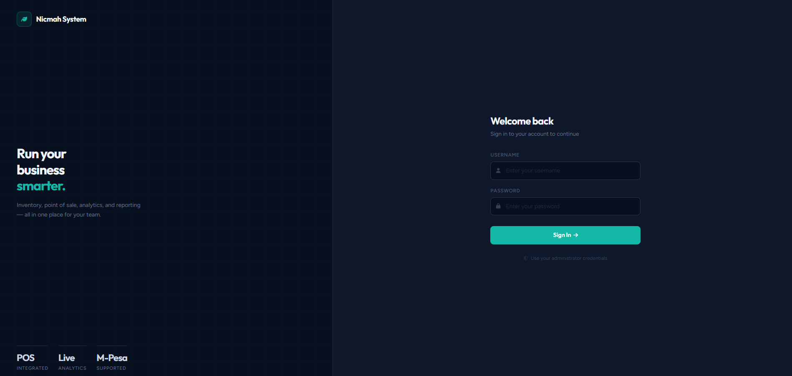
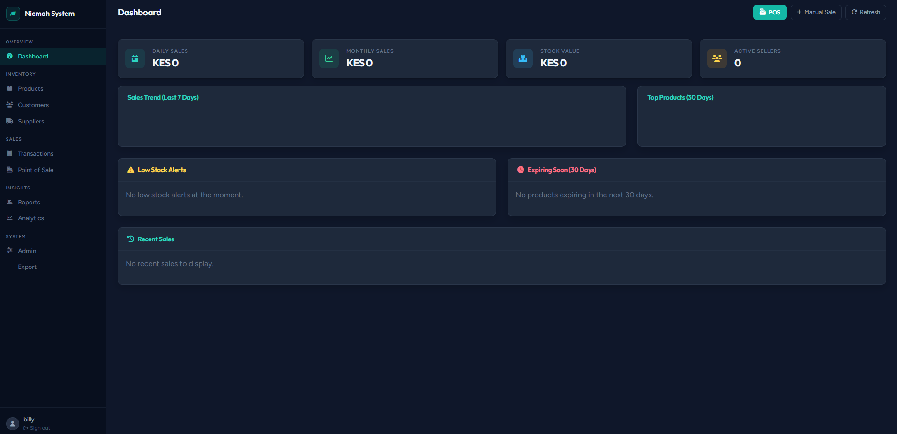
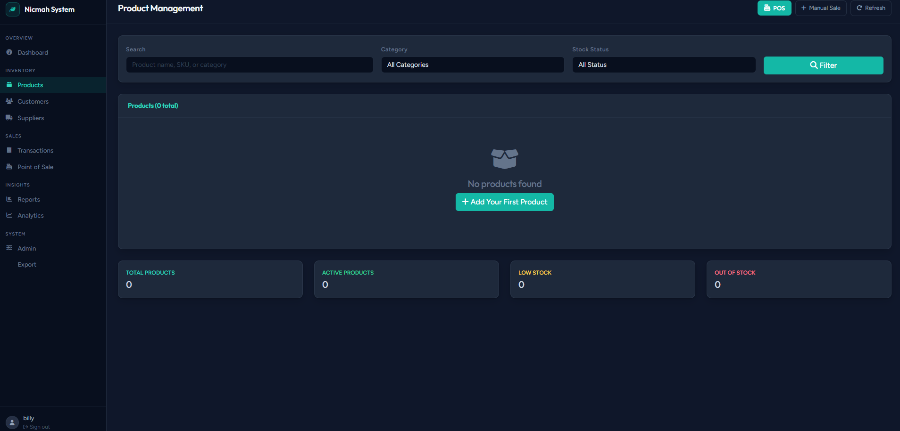
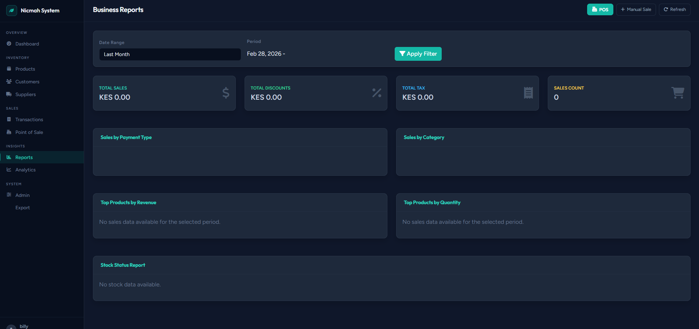
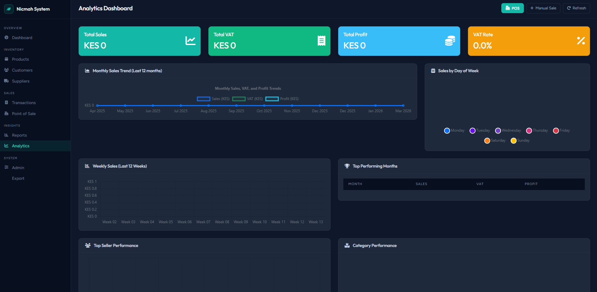

# 🏪 Nicmah System Management

A comprehensive Django-based web application for managing business operations including sales tracking, inventory management, financial reporting, and automated backups.

## 📸 Screenshots

### Login

> Secure login screen with a clean, modern dark theme — *"Run your business smarter."*

### Dashboard

> At-a-glance overview of today's sales, stock value, customer count, low stock alerts, and expiry warnings.

### Product Management

> Browse, filter, and manage your entire product catalog with stock status indicators.

### Business Reports

> Date-range reports covering total sales, purchases, VAT, and sales breakdown by payment type and category.

### Analytics Dashboard

> Deep-dive charts: 12-month sales trends, weekly performance, top sellers, and category performance.

---

## ✨ Features

### 🎯 Core Business Functions
- **Point of Sale (POS)**: Touch-friendly POS interface for fast transaction processing
- **Sales Management**: Track sales, sellers, and revenue with payment status
- **Customer Management**: Customer profiles with loyalty points and debt tracking
- **Supplier Management**: Supplier directory with contact details and lead times
- **Purchase Orders**: Create and track stock orders from suppliers (draft → sent → received)
- **Inventory Control**: Product management with batch tracking, expiry dates, and product images
- **Financial Reporting**: COGS, Gross Profit, and sales analytics
- **Stock Management**: Reorder alerts, low stock warnings, and stock adjustments
- **Seller Management**: Track sales performance and commissions by individual sellers
- **VAT Tracking**: Comprehensive Value Added Tax tracking and calculations

### 📊 Analytics & Reporting
- **Dashboard**: Real-time metrics with interactive charts
- **Sales Reports**: Daily, weekly, monthly, and custom date range reports
- **Product Performance**: Top movers, slow movers, and profitability analysis
- **Stock Reports**: Current stock levels, expiry alerts, and reorder recommendations
- **Financial Analytics**: Revenue trends, profit margins, and cost analysis
- **VAT Reports**: VAT collection tracking and rate analysis across all transactions

### 🔄 Data Management
- **Import/Export**: Excel and CSV support for bulk data operations
- **Automated Backups**: Daily database backups with compression and retention
- **Data Validation**: Comprehensive data integrity checks
- **Audit Trail**: Track all changes and modifications

### 🛡️ Security & Reliability
- **User Authentication**: Secure login system with role-based access
- **Data Backup**: Automated daily backups with configurable retention
- **Offline Operation**: Designed for local LAN deployment without internet dependency
- **SQLite Database**: Lightweight, reliable local database

## 🚀 Quick Start

### Prerequisites
- Python 3.11 or higher
- Windows 10/11, macOS 10.15+, or Linux (Ubuntu 20.04+)
- 4GB RAM minimum, 8GB recommended
- 2GB free disk space

### 1. Clone and Setup
```bash
# Clone the repository
git clone <your-repo-url>
cd nicmah_system

# Create virtual environment
python -m venv venv

# Activate virtual environment
# Windows:
venv\Scripts\activate
# macOS/Linux:
source venv/bin/activate

# Install dependencies
pip install -r requirements.txt
```

### 2. Environment Configuration
```bash
# Copy environment template
cp env.example .env

# Edit .env file with your settings
# Windows: notepad .env
# macOS/Linux: nano .env
```

**Required Environment Variables:**
```env
SECRET_KEY=your-super-secret-key-here-change-this-in-production
DEBUG=True
ALLOWED_HOSTS=localhost,127.0.0.1,192.168.1.0/24
DATABASE_URL=sqlite:///db.sqlite3
BACKUP_DIR=backups/
BACKUP_RETENTION_DAYS=30
```

### 3. Database Setup
```bash
# Run database migrations
python manage.py makemigrations
python manage.py migrate

# Create superuser
python manage.py createsuperuser

# Load sample data (optional)
python manage.py loaddata sample_data.json
```

### 4. Start the Application
```bash
# Development server
python manage.py runserver

# Production server (LAN access)
python manage.py runserver 0.0.0.0:8000
```

**Access URLs:**
- **Main Application**: http://localhost:8000
- **Admin Panel**: http://localhost:8000/admin
- **API Endpoints**: http://localhost:8000/api/

## 🏗️ Project Structure

```
nicmah_system/
├── nicmah_system/          # Django project settings
│   ├── __init__.py
│   ├── settings.py          # Main configuration
│   ├── urls.py              # URL routing
│   ├── wsgi.py              # WSGI application
│   └── asgi.py              # ASGI application
├── core/                    # Main application
│   ├── __init__.py
│   ├── admin.py             # Admin interface
│   ├── models.py            # Database models
│   ├── views.py             # Business logic
│   ├── urls.py              # App URLs
│   ├── api_urls.py          # API endpoints
│   ├── cron.py              # Automated backups
│   └── management/          # Management commands
│       └── commands/
│           ├── import_products.py
│           └── export_data.py
├── templates/               # HTML templates
│   ├── base.html            # Base template
│   └── core/                # App templates
│       ├── dashboard.html      # Dashboard
│       ├── reports.html        # Reports
│       ├── product_list.html   # Products
│       ├── product_detail.html # Product details
│       ├── sale_list.html      # Sales
│       ├── pos.html            # Point of Sale interface
│       ├── customer_list.html  # Customer management
│       ├── supplier_list.html  # Supplier management
│       └── export_data.html    # Export interface
├── static/                  # Static files (CSS, JS, images)
├── media/                   # User uploaded files
├── backups/                 # Automated backups
├── requirements.txt          # Python dependencies
├── manage.py                # Django management
├── .env                     # Environment variables
├── .gitignore               # Git ignore rules
└── README.md                # This file
```

## 📊 Database Models

### Core Entities
- **Customer**: Customer profiles with loyalty points, debt balance, phone, and email
- **Supplier**: Supplier directory with contact person, lead time, and address
- **Seller**: Staff seller profiles linked to Django users, with commission rate and totals
- **Product**: Product information, pricing, categories, images, and default supplier
- **Batch**: Inventory batches with expiry dates and supplier FK (legacy text field retained)
- **PurchaseOrder**: Stock orders from suppliers with draft/sent/received/cancelled status
- **PurchaseOrderItem**: Line items within a purchase order
- **Sale**: Sales transactions linked to Customer and Seller, with `is_paid` flag
- **SaleItem**: Individual items in a sale
- **StockAdjustment**: Stock modifications and corrections
- **BackupLog**: Automated backup tracking

### Key Relationships
- Products belong to a default Supplier and have multiple Batches
- Batches are linked to a Supplier (FK) with a `legacy_supplier` text field for old data
- Sales are linked to a Customer and a Seller; unpaid sales increment the customer's debt balance
- PurchaseOrders belong to a Supplier and contain PurchaseOrderItems
- Sellers have a OneToOne relationship with Django's auth User model

## 💰 VAT Tracking System

### Overview
The Nicmah System includes comprehensive Value Added Tax (VAT) tracking to ensure accurate financial reporting and compliance with tax regulations.

### VAT Configuration
- **Product-Level VAT Rates**: Each product has a configurable VAT rate (default: 16%)
- **Flexible VAT Rates**: Support for different VAT rates per product category
- **Admin Management**: Easy VAT rate updates through Django admin interface

### VAT Calculations
- **Subtotal**: Price excluding VAT (Quantity × Unit Price)
- **VAT Amount**: Tax calculated on subtotal (Subtotal × VAT Rate)
- **Total Price**: Final price including VAT (Subtotal + VAT Amount)
- **Sale Total**: Sum of all item totals including VAT

### Database Fields Added
#### Product Model
- `vat_rate`: Decimal field for VAT percentage (default: 16.0%)

#### Sale Model
- `subtotal`: Total amount excluding VAT
- `total_vat`: Total VAT amount for the sale
- `total_amount`: Total amount including VAT

#### SaleItem Model
- `vat_rate`: VAT rate applied to the item
- `vat_amount`: VAT amount for the item
- `price_without_vat`: Item price excluding VAT

### VAT Reports
- **VAT Collection Summary**: Total VAT collected by period
- **VAT Rate Analysis**: Breakdown by different VAT rates
- **Product VAT Performance**: VAT contribution by product
- **Seller VAT Tracking**: VAT collection by individual sellers

### Management Commands
- `update_vat_data`: Update existing data with VAT information
- Supports dry-run mode for testing changes
- Configurable default VAT rates

## 🔧 Configuration

### Django Settings
The application is configured through `nicmah_system/settings.py` with:
- SQLite database (configurable for other databases)
- Static and media file handling
- REST Framework configuration
- Automated backup settings
- Logging configuration

### Environment Variables
Use `.env` file for sensitive configuration:
- Database credentials
- Secret keys
- Backup settings
- Network configuration

## 📈 Dashboard Features

### Real-time Metrics
- Daily and monthly sales totals
- Current stock value
- Unique customer count
- Low stock alerts

### Interactive Charts
- Sales trends (7-day line chart)
- Top products (doughnut chart)
- Payment type distribution
- Category performance

### Alert Systems
- Low stock warnings
- Expiry date alerts (30/60/90 days)
- Reorder level notifications

## 📋 Reports

### Sales Reports
- **Daily/Weekly/Monthly**: Revenue tracking and trends
- **Customer Analysis**: Purchase patterns and loyalty
- **Product Performance**: Top movers and slow movers
- **Payment Analysis**: Cash, credit, and mobile money trends

### Inventory Reports
- **Stock Status**: Current levels and reorder alerts
- **Expiry Management**: Products expiring soon
- **Batch Tracking**: Supplier and expiry information
- **Stock Movements**: Adjustments and corrections

### Financial Reports
- **Profit Margins**: Product and category profitability
- **COGS Analysis**: Cost of goods sold tracking
- **Revenue Trends**: Sales performance over time
- **Discount Analysis**: Promotional impact

## 🔄 Data Import/Export

### Import Features
- **Excel/CSV Support**: Bulk product and batch import
- **Data Validation**: Automatic error checking
- **Batch Processing**: Handle large datasets efficiently
- **Template Downloads**: Pre-formatted import templates

### Export Features
- **Multiple Formats**: Excel (.xlsx) and CSV
- **Filtered Exports**: Date range and type filtering
- **Custom Fields**: Select specific data columns
- **Summary Totals**: Include calculated summaries

## 💾 Backup System

### Automated Backups
- **Daily Backups**: Automatic database dumps
- **Weekly Backups**: Comprehensive backups with media files
- **Compression**: ZIP compression for storage efficiency
- **Retention Policy**: Configurable backup retention (default: 30 days)

### Manual Backups
- **On-demand Backups**: Create backups when needed
- **Selective Backups**: Choose specific data types
- **External Storage**: Copy to USB drives or network shares

### Backup Management
- **Backup Logging**: Track all backup operations
- **Integrity Checks**: Verify backup file validity
- **Restore Functionality**: Database restoration from backups
- **Space Management**: Automatic cleanup of old backups

## 🧪 Testing

### Running Tests
```bash
# Run all tests
python manage.py test

# Run specific app tests
python manage.py test core

# Run with coverage
coverage run --source='.' manage.py test
coverage report
coverage html
```

### Test Coverage
- **Model Tests**: Database operations and validations
- **View Tests**: Business logic and user interactions
- **Admin Tests**: Admin interface functionality
- **API Tests**: REST endpoint functionality

## 🚀 Deployment

### Local LAN Deployment
```bash
# Run on all network interfaces
python manage.py runserver 0.0.0.0:8000

# Access from other computers
# http://YOUR_IP_ADDRESS:8000
```

### Production Considerations
- **Gunicorn**: Production WSGI server
- **Static Files**: Collect and serve static files
- **Database**: Consider PostgreSQL for larger datasets
- **Backup Storage**: External backup locations
- **Monitoring**: Log monitoring and error tracking

### System Requirements
- **Minimum**: 4GB RAM, 2GB disk space
- **Recommended**: 8GB RAM, 10GB disk space
- **Network**: Local area network (LAN) access
- **OS**: Windows 10+, macOS 10.15+, Ubuntu 20.04+

## 🔒 Security Features

### Authentication
- **User Management**: Admin and staff user accounts
- **Session Security**: Secure session handling
- **Access Control**: Role-based permissions

### Data Protection
- **Input Validation**: Comprehensive data validation
- **SQL Injection Protection**: Django ORM security
- **XSS Protection**: Template security features
- **CSRF Protection**: Cross-site request forgery protection

## 📱 User Interface

### Responsive Design
- **Mobile Friendly**: Works on all device sizes
- **Bootstrap 5**: Modern, professional appearance
- **Font Awesome**: Rich icon library
- **Chart.js**: Interactive data visualizations

### Navigation
- **Sidebar Menu**: Easy access to all features
- **Breadcrumbs**: Clear navigation paths
- **Search & Filters**: Advanced data filtering
- **Quick Actions**: Common task shortcuts

## 🛠️ Management Commands

### Available Commands
```bash
# Import products from Excel/CSV
python manage.py import_products path/to/file.xlsx

# Export data to Excel/CSV
python manage.py export_data products --format excel

# Create manual backup
python manage.py shell
>>> from core.cron import manual_backup
>>> manual_backup()
```

### Custom Commands
- **import_products**: Bulk product import
- **export_data**: Data export in multiple formats
- **backup_management**: Backup operations and monitoring

## 🔧 Troubleshooting

### Common Issues

#### Database Connection
```bash
# Check database status
python manage.py dbshell

# Reset database (WARNING: destroys all data)
python manage.py flush
```

#### Static Files
```bash
# Collect static files
python manage.py collectstatic

# Check static file configuration
python manage.py findstatic core/css/style.css
```

#### Backup Issues
```bash
# Check backup directory permissions
ls -la backups/

# Test backup functionality
python manage.py shell
>>> from core.cron import daily_backup
>>> daily_backup()
```

### Log Files
- **Django Logs**: `logs/django.log`
- **Application Logs**: Check Django admin for BackupLog entries
- **System Logs**: Check system event logs

## 📚 API Documentation

### Available Endpoints
- **GET /api/dashboard-data/**: Dashboard metrics and charts
- **POST /api/export/**: Data export operations
- **GET /api/products/**: Product information
- **GET /api/sales/**: Sales data
- **GET /pos/**: Point of Sale interface
- **GET /customers/**: Customer list and management
- **GET /suppliers/**: Supplier list and management

### Authentication
- **Session-based**: Uses Django session authentication
- **Admin Access**: Admin users have full API access
- **Rate Limiting**: Built-in request throttling

## 🛡️ Security & Production Deployment

### ⚠️ **Critical Security Notice**
This system contains sensitive business data and MUST be properly secured before production deployment.

**Before going live:**
1. Read the complete [SECURITY.md](SECURITY.md) guide
2. Create a `.env` file with production values
3. Generate a strong SECRET_KEY
4. Configure HTTPS/SSL
5. Use a production database (PostgreSQL/MySQL)
6. Set `DEBUG = False`

### 🔐 **Security Features**
- **Authentication Required**: All views require user login
- **CSRF Protection**: Built-in Django CSRF protection
- **XSS Protection**: Security headers and template escaping
- **SQL Injection Protection**: Django ORM with parameterized queries
- **Session Security**: Secure session management
- **Password Validation**: Strong password requirements

### 🚀 **Production Deployment**
See [SECURITY.md](SECURITY.md) for complete production deployment guide.

**Quick Start for Production:**
```bash
# 1. Create production environment file
cp env.example .env
# Edit .env with production values

# 2. Generate secret key
python -c "from django.core.management.utils import get_random_secret_key; print(get_random_secret_key())"

# 3. Set production settings
export DJANGO_SETTINGS_MODULE=nicmah_system.production_settings

# 4. Collect static files
python manage.py collectstatic

# 5. Run with production server
gunicorn nicmah_system.wsgi:application
```

## 🤝 Contributing

### Development Setup
1. Fork the repository
2. Create a feature branch
3. Make your changes
4. Add tests for new functionality
5. Submit a pull request

### Code Standards
- **PEP 8**: Python code style
- **Django Best Practices**: Follow Django conventions
- **Documentation**: Include docstrings and comments
- **Testing**: Maintain test coverage

## 📄 License

This project is licensed under the MIT License - see the LICENSE file for details.

## 🆘 Support

### Getting Help
- **Documentation**: Check this README first
- **Issues**: Report bugs via GitHub issues
- **Community**: Django community forums
- **Professional Support**: Contact for enterprise support

### Contact Information
- **Project Maintainer**: [Billy]
- **Email**: [idontfeellikesharing]
- **GitHub**: [BillyMwangiDev]

## 🎯 Roadmap

### Planned Features
- **Mobile App**: Native mobile application
- **Advanced Analytics**: Machine learning insights
- **Multi-location**: Support for multiple shops
- **Integration**: Third-party system integration
- **Cloud Sync**: Optional cloud backup and sync

### Version History
- **v1.0.0**: Initial release with core functionality
- **v1.1.0**: Enhanced reporting and analytics
- **v1.2.0**: Advanced backup and restore features
- **v2.0.0**: Customer, Supplier, and Seller models; POS interface; Purchase Orders; product images; payment status tracking

---

**Built with ❤️ using Django and modern web technologies**

*Last updated: March 2026*
